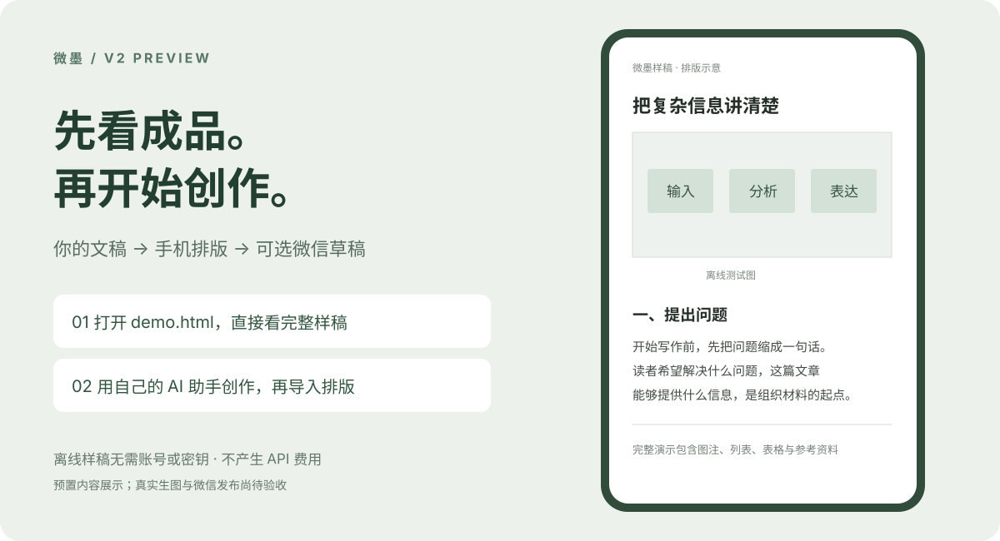

<div align="center">

# 微墨 · v2

### 把一份文稿，变成一篇值得打开的公众号文章。

**AI 助手创作 · 学术风配图 · 手机排版 · 可选草稿发布**

[先看效果](#先看效果) · [快速体验](#快速体验) · [开始创作](#开始创作) · [旧版入口](https://github.com/Snowwit88/wechat-ink/tree/legacy-v1)



</div>

## 先看效果

你提供主题和资料，由你已有的 AI 助手调研、写作；微墨负责文稿检查、配图工具和排版。先在浏览器看成品，满意后再选择是否发送到公众号草稿箱。

**现在就能看的：**仓库附带完整样稿、七张测试图和一个可直接打开的离线预览。无需公众号、无需密钥，也不会产生服务费用。

> **v2 预览版。** 离线演示使用预置文章和程序绘制的测试图，不是现场 AI 生成。真实生图和微信草稿流程已实现，但尚未完成真实服务验收。

## 快速体验

### 不安装，直接看

1. [下载新版 ZIP](https://github.com/Snowwit88/wechat-ink/archive/refs/heads/main.zip)，解压。
2. 双击 **`demo.html`**，在浏览器查看完整手机样稿。
3. 从正文一路看到参考资料，检查图片、图注、留白和长网址换行。

### 已有 Python？一条命令打开

```sh
python3 demo.py
```

这个演示只用 Python 标准库，不安装依赖、不读取凭证、不调用任何 API。Windows 可用 `python demo.py`。也可以运行 `python3 install.py --demo`。

## 开始创作

想把自己的文章做成同样的排版，再安装创作工具：

```sh
git clone https://github.com/Snowwit88/wechat-ink.git
cd wechat-ink
python3 install.py
```

需要 Python 3.10+。默认安装为独立技能 `wechat-ink-v2`，保留已有版本。安装后，在支持本地技能的 AI 客户端中使用下面这段话：

> 使用 wechat-ink-v2，根据我的主题和资料创作文章。先核对事实，再写作和审校，用学术风格排版并生成本地预览。没有生图配置时，先使用我提供的图片或仅输出配图计划；暂不发送到公众号。

**创作使用你已有的 AI 助手。微墨没有内置免费文本模型。** 不使用 AI 助手也可以自己准备 Markdown 和本地图片，使用工具排版；已有图片不需要生图 API。

[安装、导入自己的文章与完整命令 →](docs/SETUP.md)

## 三个入口，按需使用

| 我想做什么 | 需要什么 | 得到什么 |
| --- | --- | --- |
| 先看效果 | 浏览器 | 完整离线样稿 |
| 写作与排版 | 已有 AI 助手或自备文稿；Python 工具 | 可分享的 HTML 预览 |
| 生成新图片 | 自己的图片服务配置 | 原图与 16:9 封面 |
| 发送微信草稿 | 公众号凭证、白名单和固定出口 | 微信草稿与回读记录 |

公众号凭证、固定出口、生图服务都不是查看演示或排版现有文章的前提。

## 可选：发送到草稿箱

在本地确认文章后，再配置公众号和固定出口。程序验证出口后才会上传，只创建草稿，不提供正式群发入口。凭证保存在你的机器上。

[配置和发布步骤 →](docs/SETUP.md#创建微信草稿)

## 新旧版本

这是同一个“微墨”项目，**仓库地址保持不变**。

- **`main`：v2 预览版**，优先展示和体验新版。
- **[`legacy-v1`](https://github.com/Snowwit88/wechat-ink/tree/legacy-v1)：第一版快照**，保留原代码、安装说明及许可声明。
- v2 尚未完整复刻 v1：部分主题细节、跨平台同步、Cookie 生图、自定义样式 JSON 未迁入。依赖这些功能时请继续使用 v1。
- 微信客户端最终效果与真实服务稳定性仍需验收。[查看测试范围与已知限制](VALIDATION.md)。

## 反馈与参与

欢迎在 [Issues](https://github.com/Snowwit88/wechat-ink/issues) 提交排版截图、复现步骤和使用建议。请勿上传 API Key、AppSecret 或包含凭证的配置文件。

如果微墨确实帮你节省了整理和排版时间，欢迎 Star，让更多创作者看到它。

## 许可与项目关系

新版代码采用 [MIT](LICENSE)，依赖说明见 [THIRD_PARTY.md](THIRD_PARTY.md)。旧版按其分支内的许可与来源说明分发。

本项目由独立开发者维护，与腾讯、微信或 WeChat 官方无隶属或赞助关系。
