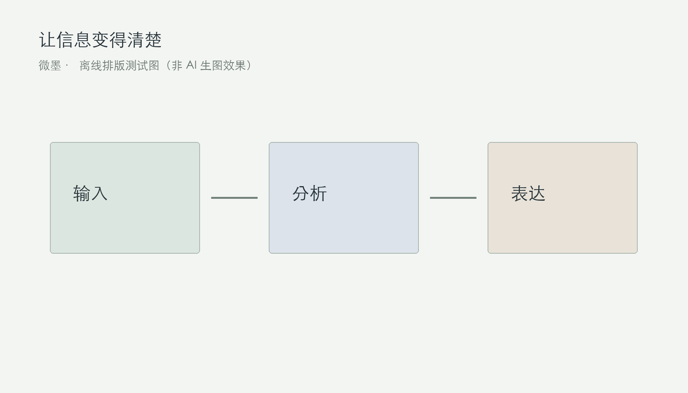
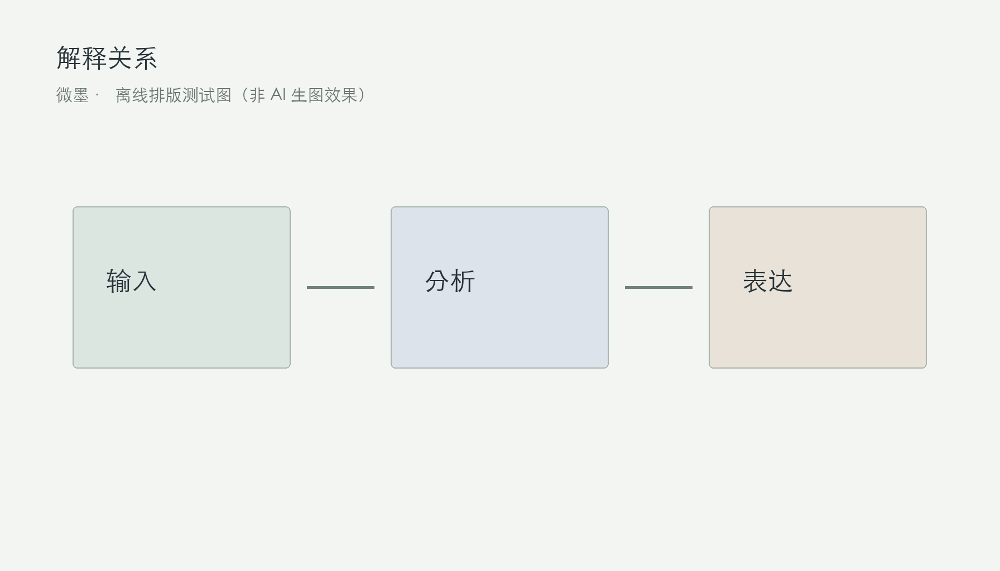

# 把复杂信息讲清楚：从资料到一篇文章

这是一份离线验证样稿。七张配图由程序绘制，只用来检验图片比例、间距和手机排版，不代表真实生图服务的画质。

## 一、提出问题

开始写作前，先把问题缩成一句话。读者希望解决什么问题，这篇文章能够提供什么信息，是组织材料的起点。

## 二、核对证据

一条判断最好能找到直接依据。资料可以来自公开文档、研究论文或一手记录；尚未核实的信息，应保留不确定性。

> 这是一段引文样式测试。它不是来自外部文献的引用。

## 三、建立结构

每个小节只回答一个主要问题。先交代事实，再解释关系，最后说明判断成立的条件。段落之间的顺序应当自然。

- 一个段落表达一个意思。
- 关键结论给出证据。
- 不确定的地方明确说明。

## 四、解释关系

图表不是装饰。它应当补充文字难以说明的关系，例如步骤、时间顺序或不同选项之间的差别。

| 检查项 | 预期结果 |
| --- | --- |
| 图片 | 不超出手机页面 |
| 参考资料 | 来源和 URL 紧凑排列 |

## 五、观察边界

结论需要边界。样本、时间和适用条件都会影响判断；明确这些条件，比用肯定的语气掩盖它们更有帮助。

## 六、形成判断

完成初稿后，分别检查事实和表达。事实核查关注来源，表达检查关注读者是否能一次看懂。两次检查各有重点。

## 七、参考资料

以下链接仅用于排版验证，不作为前述写作建议的引文依据。

1. markdown-it-py：Using markdown_it；
https://markdown-it-py.readthedocs.io/en/latest/using.html
2. GitHub Docs：About READMEs；
https://docs.github.com/en/repositories/managing-your-repositorys-settings-and-features/customizing-your-repository/about-readmes
